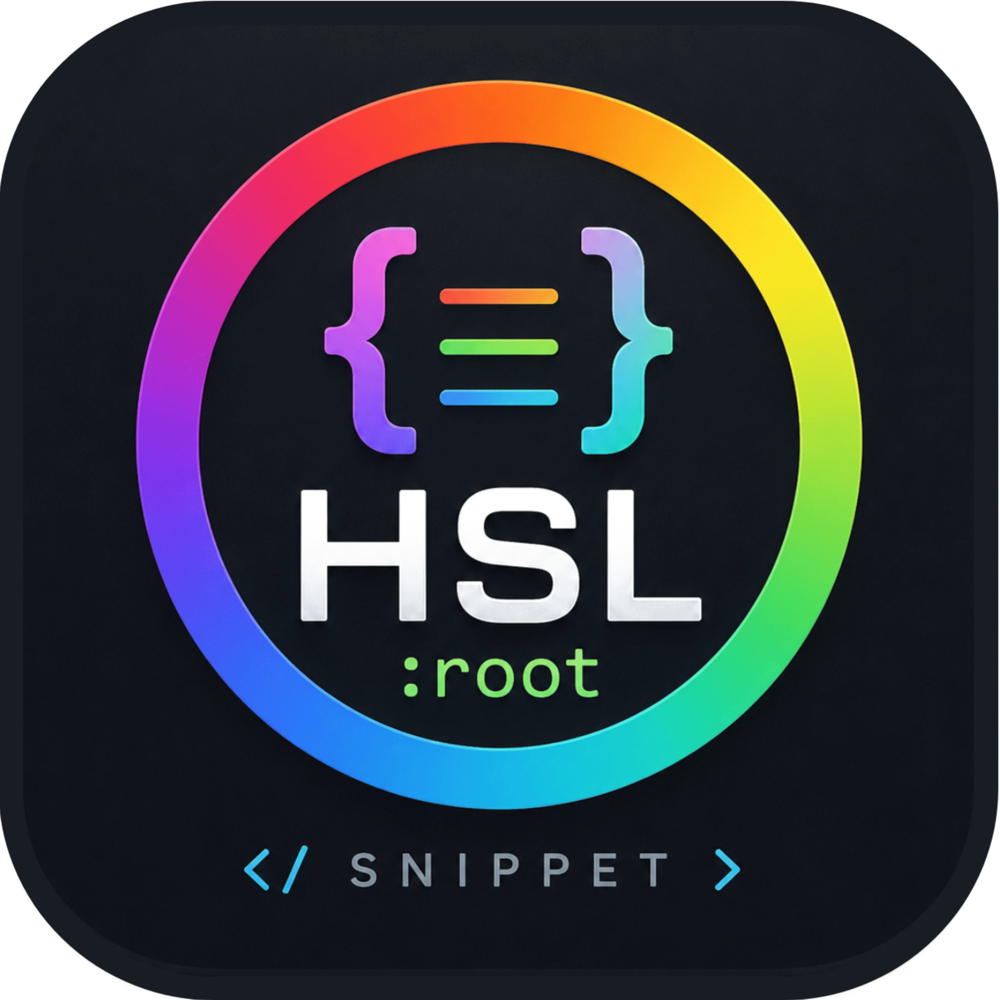

<div align="center">



# HSL Root Snippet


<br></br>


### ONE TRIGGER | INFINITE PALLETES

</div>

> - Generate your complete HSL `:root` in seconds — pick your color, pick your mode, done.
> - Inspired by _modern HSL design systems._

---

## ✨ Features

- ⚡ **Instant snippet expansion** — Just by pressing `CTRL+Alt+H`
- 🎨 **7 color presets** — Purple, Blue, Pink, Green, Cyan, Orange, Red
- 🌗 **Dark & Light mode** — full HSL palette for both
- 🖱️ **Smart cursor** — auto-jumps to `--hue` after insert
- 🪶 **Zero config** — works out of the box

---

## 🚀 How to Use

1. Open any `.css` file in Acode
2. Press `CTRL+Alt+H`
3. **Choose your color** from the dropdown
4. **Choose your mode** — Dark or Light
5. `:root` snippet appears instantly ✅

---

## 🎨 Color Presets

| Color                 | Hue Value |
| --------------------- | --------- |
| 🟣 Purple _(default)_ | `255`     |
| 🔵 Blue               | `220`     |
| 🩷 Pink               | `300`     |
| 🟢 Green              | `110`     |
| 🩵 Cyan               | `180`     |
| 🟠 Orange             | `15`      |
| 🔴 Red                | `358`     |

> Want a custom hue? Change `--hue` value after insert.
> Explore more at [hslpicker.com](https://hslpicker.com) or [htmlcolorcodes.com](https://htmlcolorcodes.com)

---

## 📦 Snippet Output

```css
:root {
	--header-height: 3.5rem;
	--hue: 255;
	--first-color: hsl(var(--hue), 60%, 64%);
	--first-color-alt: hsl(var(--hue), 80%, 56%);
	--first-color-alt-2: hsl(var(--hue), 60%, 56%);
	--first-color-light: hsl(var(--hue), 60%, 74%);
	--title-color: hsl(240, 8%, 95%);
	--text-color: hsl(240, 8%, 70%);
	--text-color-light: hsl(240, 8%, 50%);
	--body-color: hsl(240, 100%, 2%);
	--container-color: hsl(240, 8%, 6%);
}
```

---

## ⚠️ Notes

- Works on **`.css` files only**
- Requires Acode **v1.12.6+** (minVersionCode 1001)

---

## 🐛 Bug Report & Feature Request

Found a bug or have an idea?
**Open an issue here →** [Click here](https://github.com/Panggil-aja-Kaka/hsl-root-snippet-acode-plugin)

---

## 💰 Support Development

This project is developed and maintained in my free time. If you find it useful, you can help support future development through a small contribution.

Your support helps with:

- 🛠️ Maintenance and bug fixes
- 🚀 New features and improvements
- 📦 Faster development updates
- ❤️ Keeping the project alive

---

## ☕ Support the Project

You can support this project through:

[
](https://trakteer.id/bayanaka4)[

](https://saweria.co/BayanakaDev)

Every contribution, no matter how small, helps keep the project active and continuously improving.

---

## 🧪 Early Access & Beta Program

Supporters may have the opportunity to receive:

- Pre-release versions
- Beta testing access
- Early access to upcoming features
- Preview of major updates before public release

Please note that beta access is not guaranteed for every supporter, but contributors may be prioritized when testing new releases.

---

## ⭐ Leave a Review

If you enjoy using this plugin, consider leaving a review on:

- Acode Marketplace
- GitHub Repository

A positive review or even a simple ⭐ star helps more users discover the project and supports its growth.

---

## ❤️ Thank You

Whether you contribute through donations, feedback, bug reports, reviews, or simply by using the plugin, your support is greatly appreciated.

Thank you for helping make this project better for everyone.

---

<div align="center">

### 👨‍💻 Created by : Bayanaka

Open Source Developer & Acode Plugin Creator

<br>

<a href="https://github.com/Panggil-aja-Kaka">
  
</a>

</div>
